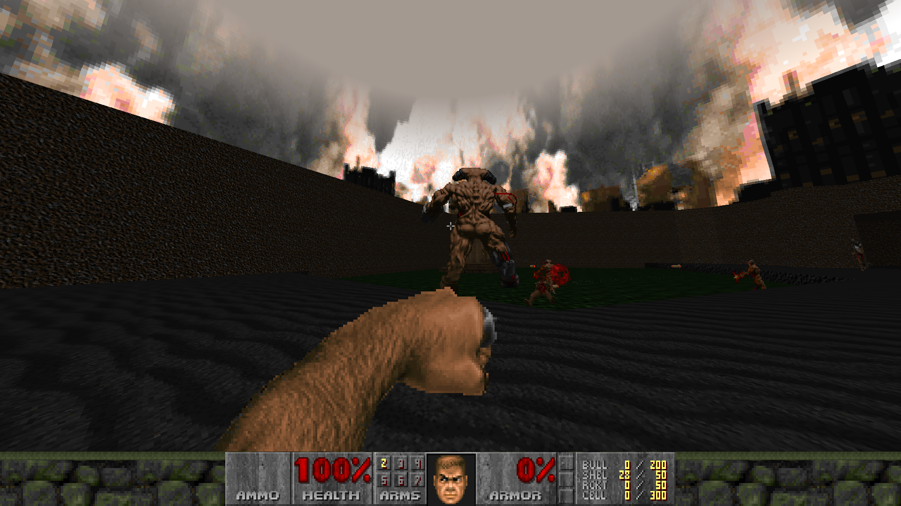
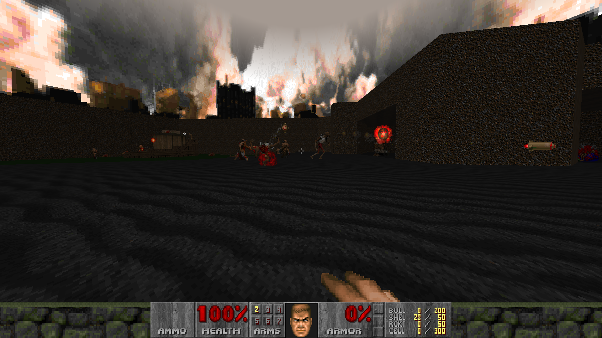

# Cyberdemon Allies

Have you ever wandered around Hell, coming across loads of Cyberdemons along
your way, and thought, "Man, I wish I had one of those."

Well, with this mod, now you can have **ALL of them!**

Cyberdemon Allies is an incredibly simple DOOM mod that allows Doomguy to summon
as many miniature Cyberdemons as he wants to do his dirty work for him, turning
DOOM into the world's worst strategy game!





## Gameplay

You start with the Cyberdemon Summoner, which is actually just your fist.
This fist, when punched, will throw out a summoner projectile and spawn a
mini Cyberdemon when it lands.

Each mini Cyberdemon fires quick volleys of three rockets at any enemy it sees,
and if the player has <100% health, it will throw a stimpack at the player.

Also in your kit is the Cyberdemon Retractor, which is a super-powered chainsaw
which can remove a Cyberdemon Ally (primary fire) or all Cyberdemon Allies
(secondary fire) at the click of a button.

Otherwise, it's just standard DOOM. Try not to get blown up by your own allies.

## Installation

### Windows

1. Download the ZIP file from GitHub.
2. Rename it to `CyberdemonAllies.pk3`.
3. Run `GZDoom.exe` with the `CyberdemonAllies.pk3` file.

### macOS

1. Download the ZIP file from GitHub.
2. Rename it to `CyberdemonAllies.pk3`.
3. Run `GZDoom.app` and put `-file path/to/CyberdemonAllies.pk3` in the
arguments.

### Linux (Flatpak)

This requires the GZDoom Flatpak to have access to your home folder. To make
this easier, use [Flatseal](https://flathub.org/apps/com.github.tchx84.Flatseal).
Otherwise, use the command `flatpak override org.zdoom.GZDoom --filesystem=/home/<your username>`.

```bash
git clone https://github.com/AeriaVelocity/CyberdemonAllies.git
zip -r CyberdemonAllies.pk3 CyberdemonAllies/
flatpak run org.zdoom.GZDoom -file CyberdemonAllies.pk3
```

If you got GZDoom on Linux without Flatpak, ignore the Flatpak-specific advice
and substitute `flatpak run org.zdoom.GZDoom` with `gzdoom` in the command
above.